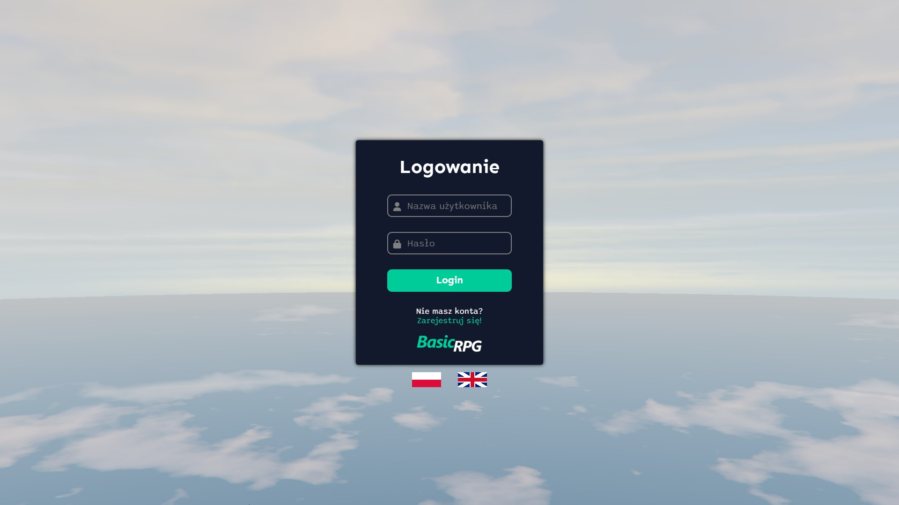
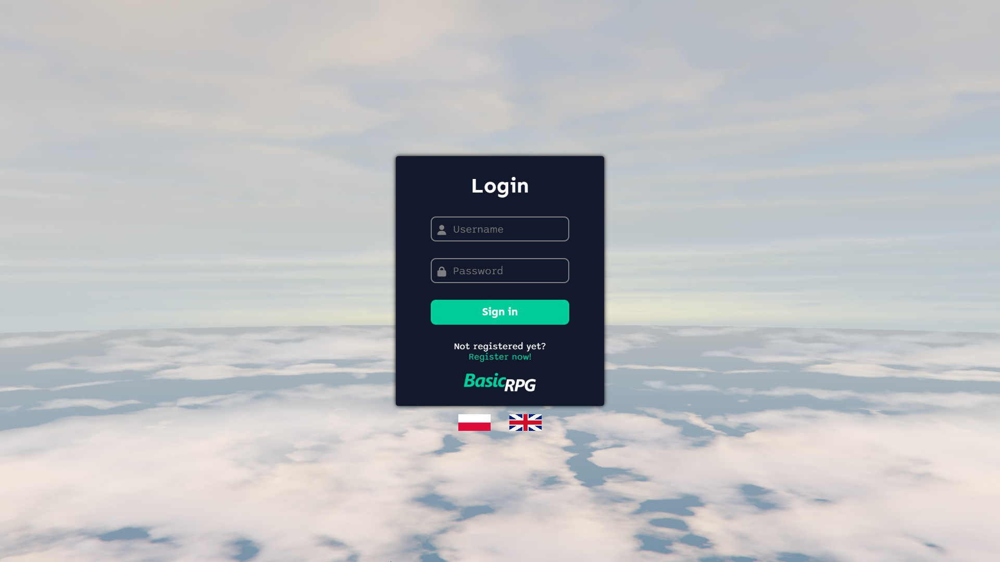
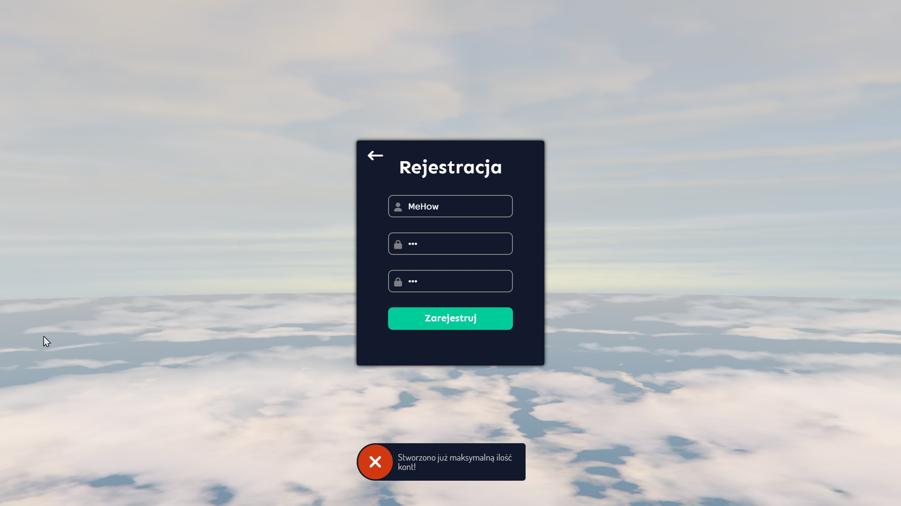
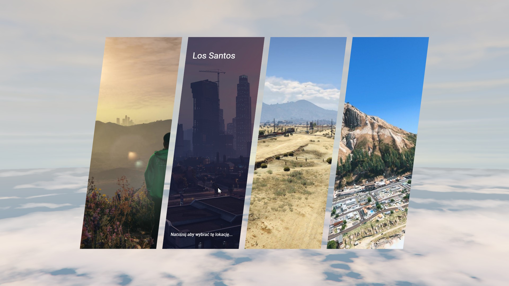
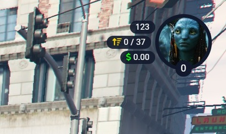
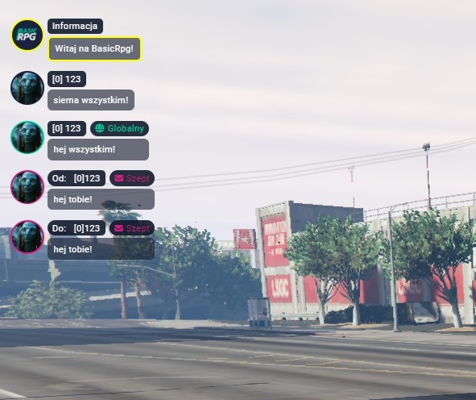
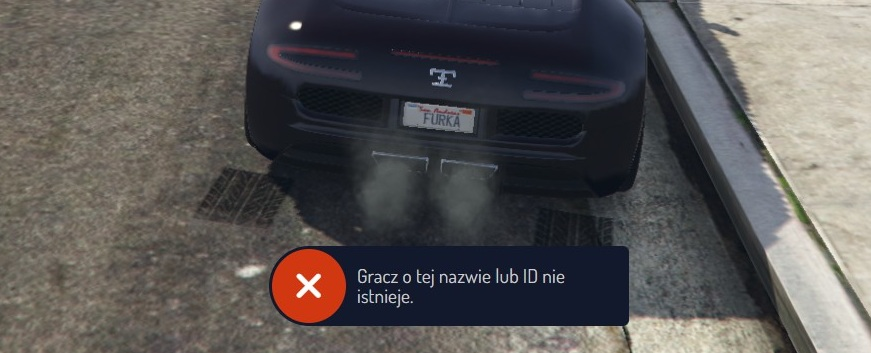
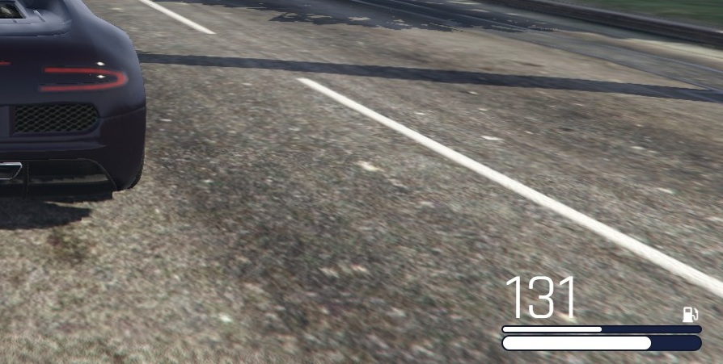
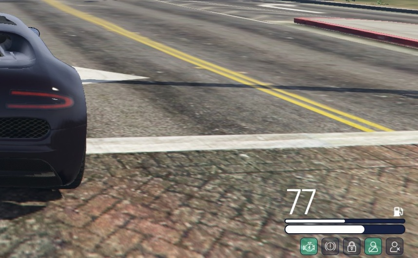

# Portfolio - mehow

## O mnie
- Michał - 27 lat
- Na co dzień .NET Developer
- Ponad 2000 godzin na serwerach RPG na platformach opartych o GTA
- Kilkaset godzin developmentu serwerów RageMP (hobbystycznie)

## Motywacja
- Siedziałem dużo z własnymi serwerami, pisząc je od zera - lubię to
- Chcę sprawdzić się w rozwoju istniejącego projektu
- Dużo czasu spędziłem na FiveLife, znam biznes :D
- Nudzę się, a jednoosobowy rozwój serwera jest przytłaczający

## Moje Projekty

### Projekt 1 - RPGValley
Moje pierwsze podejście do tworzenia serwera RageMP. Pisałem to w trakcie studiów, nie mając dużego doświadczenia z programowaniem i architekturą aplikacji.
Pisząc ten serwer skupiałem się głównie na szybkiej implementacji, po czasie zrozumiałem że był to błąd. 
Ma on sporo działających funkcjonalności, aczkolwiek nie jestem dumny z większości rozwiązań pod względem czystości i utrzymania kodu.

**Technologie:**
- Serwer: .NET Core 3.1
- Baza danych: MySQL
- Klient: JS
- Web: HTML + JS/JQuery + CSS

**Główne osiągnięcia:**
- 10 funkcjonujących prac
- Rangi użytkowników z uprawnieniami do niektórych funkcjonalności
- Pojazdy i ich tuning, wraz z opcjami kupna w salonach
- Biznes - warsztat tuningowy
- Frakcja - LSPD (podstawowe funkcje)
- Chat, voice chat
- Rozwój umiejętności postaci i drzewko rozwoju prac
- Ekwipunek podzielony na sloty
- Tablet pełniący funkcję panelu serwerowego, dający dostęp do informacji i ustawień

### Projekt 2 - BasicRPG
Mój drugi poważny projekt. W nim włożyłem najwięcej czasu w architekturę backendu. 
Głównym celem było stworzenie środowiska programistycznego które narzuci strukturę i sprawi że utrzymanie kodu w przyszłości będzie łatwiejsze.
Funkcjonalności które na nim zaimplementowałem nie są obszerne, ale starałem się zmaksymalizować ich jakość.

**Technologie:**
- Serwer: .NET 9.0
- Baza danych: PostgreSQL
- Klient: JS (z podejściami do TS)
- Web: Angular 19

**Główne osiągnięcia:**
- Panel logowania z dynamiczną zmianą języka w którym wyświetlane jest UI serwera (i18n)
- Panel rejestracji z walidacją
- Ekran wyboru spawnu
- HUD postaci z podstawowymi statystykami
- Czat globalny/prywatny/lokalny/informacyjny
- Licznik pojazdu z interaktywnym panelem zarządzania pojazdem

**Zdjęcia:**

## Umiejętności Techniczne
- **Języki programowania:** C#, SQL/TSQL, JavaScript, TypeScript
- **Frameworki/Biblioteki:** .NET, Angular 16+, React (pracowałem z nim jakieś pół roku)
- **Bazy danych:** MSSQL, PostgreSQL, MySQL, OracleDb
- **Inne narzędzia:** Powiązane :)

## Kontakt
- Discord: .mehow
- GitHub: https://github.com/mi-cichon/

## Dodatkowe Informacje
- Dostępność: Lubię porobić coś po pracy, ale nie mam w planach robić drugiego etatu, ani stać w miejscu :)
- Preferowane role w zespole: Backend/client developer